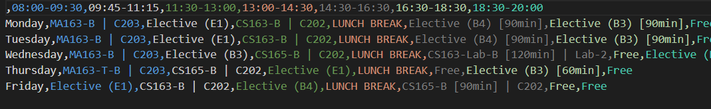
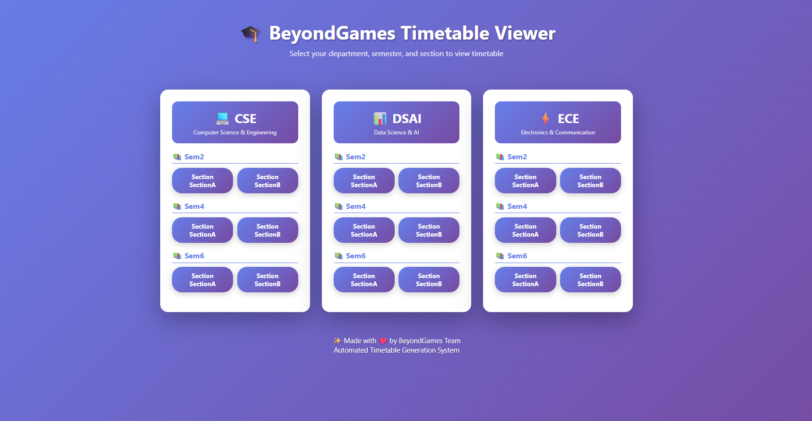
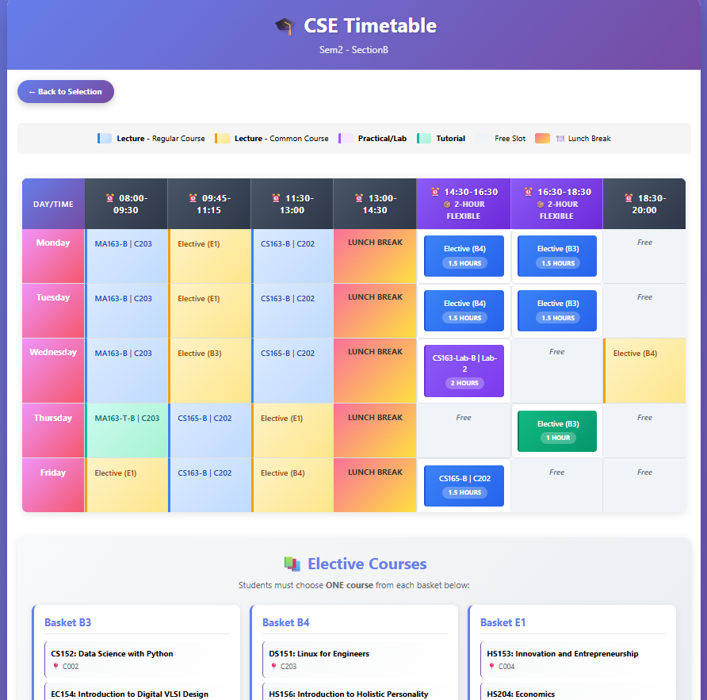

# 🎓 BeyondGames Automated Timetable Generator

[](https://www.python.org/downloads/)
[
- 18 Output CSV files (timetables)
- 18 Output TXT files (elective details)
- 19 Output HTML files (1 index + 18 timetables)
- 2 Python scripts (main.py, timetable_to_html.py)
- 3 Documentation files (README.md, CONSTRAINTS_ANALYSIS.md, TECH_STACK.md)
```g.shields.io/badge/License-MIT-yellow.svg)](https://opensource.org/licenses/MIT)
[]()
[](https://github.com/BeyondGamesTimeTable)

## 📖 Project Overview

**Developed by BeyondGames Team** - A **CSV-based Timetable Generation System** that creates optimized academic schedules for **IIIT Dharwad**. The system reads course data from CSV files to generate conflict-free timetables for multiple semesters and sections.

### 🎯 Problem Statement
Manual timetable creation involves complex constraints:
- Faculty availability conflicts
- Classroom and lab resource allocation
- LTPSC (Lecture-Tutorial-Practical-Self study-Credits) requirements
- Multi-section course scheduling
- Lunch break management

### 💡 Solution
This automated system generates optimized weekly schedules by:
- Processing CSV input files with course data
- Applying constraint-based scheduling algorithms
- Creating separate timetables for different sections
- Exporting results to CSV files and interactive HTML viewers

---

## ✨ Current Features

### 🔧 **Core Functionality**
- ✅ **CSV Data Processing** – Reads course data from CSV files (Even CSE.csv, Even DSAI.csv, Even ECE.csv)
- ✅ **Multi-Section Support** – Generates separate schedules for Section A and Section B
- ✅ **LTPSC Parsing** – Handles Lecture-Tutorial-Practical format from CSV columns
- ✅ **Conflict Prevention** – Avoids scheduling conflicts for rooms and time slots
- ✅ **Lunch Break Management** – Automatically reserves 13:00-14:30 for lunch
- ✅ **CSV Output** – Exports generated timetables to CSV format
- ✅ **HTML Visualization** – Creates interactive HTML timetable views

### 📊 **Scheduling Rules**
- ✅ **Lectures** – 1.5-hour sessions, common for both sections
- ✅ **Tutorials** – 1-hour sessions, section-specific (marked as T-A, T-B)
- ✅ **Labs/Practicals** – 2-hour sessions, section-specific (marked as P-A, P-B)
- ✅ **Time Constraints** – 5-day week (Mon-Fri), 7 time slots per day (8 AM - 8 PM)
- ✅ **Room Assignment** – Default room allocation by type (lecture halls, labs, tutorial rooms)

### 📁 **File Management**
- ✅ **Directory Setup** – Auto-creates input and output directories
- ✅ **CSV Export** – Clean CSV files for easy data import
- ✅ **HTML Generation** – Beautiful interactive web-based viewer

---

## 🚀 Quick Start

### 📋 Prerequisites
- **Python 3.12+**
- **Required packages**: `pandas`

### 📥 Installation & Setup

1. **Clone the repository**
   ```bash
   git clone https://github.com/BeyondGamesTimeTable/Automated-TimeTable-IIIT-Dharwad.git
   cd Automated-TimeTable-IIIT-Dharwad/timetable_generator
   ```

2. **Install dependencies**
   ```bash
   pip install pandas
   ```

3. **Prepare input files**
   - Place the required CSV files (`Even CSE.csv`, `Even DSAI.csv`, `Even ECE.csv`) in `timetable_generator/input_files/sdtt_inputs/`

### 🏃‍♂️ Running the Application

#### **Step 1: Generate Timetables**
```bash
# Navigate to the timetable generator directory
cd timetable_generator

# Run the main script to generate CSV timetables
# Choose ONE of the following (both produce identical outputs):
python main.py                # Class-based OOP approach
# OR
python main_functional.py     # Functional programming approach
```

#### **Step 2: Generate HTML Viewer** (Optional)
```bash
# Convert CSV files to interactive HTML format
python timetable_to_html.py
```

#### **Step 3: View Results**
```bash
# Open HTML viewer in browser
start timetable_html\index.html
# OR manually navigate to timetable_outputs/ for CSV files
```

### 📊 Required Input Files

The system expects the following CSV files in the input directory:

| File Name | Description | Required Columns |
|-----------|-------------|------------------|
| `Even CSE.csv` | CSE course information | Course Code, Course Title, Lectures, Tutorials, Practicals, Classroom, Section, Electives |
| `Even DSAI.csv` | DSAI course information | Course Code, Course Title, Lectures, Tutorials, Practicals, Classroom, Section, Electives |
| `Even ECE.csv` | ECE course information | Course Code, Course Title, Lectures, Tutorials, Practicals, Classroom, Section, Electives |

### 📤 Output Files

The system generates two types of output files:

#### **CSV Files** (Primary Output)
**Location**: `timetable_generator/timetable_outputs/`
- 18 CSV files for all department-semester-section combinations
- Easy to import into Excel, Google Sheets, or databases
- Examples: `CSE_Sem2_SectionA_Timetable.csv`, `DSAI_Sem4_SectionB_Timetable.csv`

#### **HTML Files** (Interactive Viewer)
**Location**: `timetable_generator/timetable_html/`
- `index.html` - Main navigation page
- 18 HTML timetable files with beautiful styling
- Interactive web-based viewer for easy sharing and viewing

#### **How to View Results:**
1. **CSV Files**: Open in Excel or any spreadsheet application
2. **HTML Files**: Open `timetable_html/index.html` in your browser

---

## 📁 Project Structure

```
Automated-TimeTable-IIIT-Dharwad/
├── .gitignore                       # Git ignore file
├── README.md                        # Main project documentation
├── CONSTRAINTS_ANALYSIS.md          # Detailed requirements analysis (91.7% compliance)
├── TECH_STACK.md                    # Technology stack documentation
│
├── .vscode/                         # VS Code configuration
│   ├── launch.json
│   ├── settings.json
│   └── tasks.json
│
├── screenshots/                     # Screenshots for README
│   ├── timetable_csv_view.png       # CSV timetable screenshot
│   ├── timetable_html_view1.png     # HTML viewer screenshot 1
│   └── timetable_html_view2.png     # HTML viewer screenshot 2
│
└── timetable_generator/             # Main application directory
    ├── main.py                      # Core timetable generation engine (Class-based)
    ├── main_functional.py           # Core timetable generation engine (Functional)
    ├── timetable_to_html.py         # HTML converter and viewer generator
    │
    ├── input_files/                 # Input data directory
    │   └── sdtt_inputs/             # CSV input files
    │       ├── Even CSE.csv         # CSE course data (Sem 2, 4, 6)
    │       ├── Even DSAI.csv        # DSAI course data (Sem 2, 4, 6)
    │       └── Even ECE.csv         # ECE course data (Sem 2, 4, 6)
    │
    ├── timetable_outputs/           # Generated CSV timetables
    │   ├── CSE_Sem2_SectionA_Timetable.csv
    │   ├── CSE_Sem2_SectionA_Timetable_Electives.txt
    │   ├── CSE_Sem2_SectionB_Timetable.csv
    │   ├── CSE_Sem2_SectionB_Timetable_Electives.txt
    │   ├── ... (18 CSV files + 18 TXT elective files)
    │   └── ECE_Sem6_SectionB_Timetable_Electives.txt
    │
    └── timetable_html/              # Generated HTML viewers
        ├── index.html               # Main navigation page
        ├── CSE_Sem2_SectionA_Timetable.html
        ├── CSE_Sem2_SectionB_Timetable.html
        ├── ... (18 HTML timetable files)
        └── ECE_Sem6_SectionB_Timetable.html

Total Files:
- 3 Input CSV files (course data)
- 18 Output CSV files (timetables)
- 16 Output TXT files (elective details)
- 19 Output HTML files (1 index + 18 timetables)
- 3 Python scripts (main.py, main_functional.py, timetable_to_html.py)
- 3 Documentation files (README.md, CONSTRAINTS_ANALYSIS.md, TECH_STACK.md)
```

---
n
## ⚙️ Configuration

### 🕒 Time Slots (Built-in)
```
08:00-09:30  Early Morning Slot
09:45-11:15  Morning Slot
11:30-13:00  Late Morning Slot
13:00-14:30  🍽️ LUNCH BREAK
14:45-16:15  Afternoon Slot
16:30-18:00  Late Afternoon Slot
18:15-19:45  Evening Slot
```

### 🎯 Target Semesters
- **Even Semesters**: 2, 4, 6
- **Departments**: CSE, DSAI, ECE
- **Sections**: A, B

### 🏛️ Room Assignments (Auto-allocated)
- **Large Auditorium**: C004 (240-seater for common courses)
- **Lecture Halls**: C302, C303, C304, C305
- **Tutorial Rooms**: C002, C202, C203, C204
- **Lab Rooms**: Lab-1 (auto-assigned for practicals)

---

## 🔧 Technical Details

### 🏗️ Architecture
- **Dual Implementation**: Two versions available - Class-based (main.py) and Functional (main_functional.py)
  - Both produce 100% identical outputs - choose based on your coding style preference
- **CSV Integration**: Native CSV file reading and writing using pandas
- **Constraint-Based Scheduling**: Implements scheduling algorithms with conflict detection
- **Dual Output**: Generates both CSV files for data processing and HTML for viewing

### 🔄 Scheduling Algorithm
1. **Data Loading**: Parse CSV files and extract course information with LTPSC details
2. **Schedule Initialization**: Create empty time slot grid (7 slots) with lunch breaks
3. **Common Course Scheduling**: Assign lectures common for both sections (large auditorium)
4. **Section-Specific Scheduling**: Assign tutorials and labs for individual sections
5. **Lab Scheduling**: Assign 2-hour consecutive lab sessions with proper room allocation
6. **Conflict Resolution**: Ensure no room/time conflicts and proper scheduling constraints

### 🎲 Randomization
- Uses randomized slot assignment to generate varied timetables
- Prevents predictable patterns while maintaining constraints

### 📚 Technology Stack
For complete details about the technologies, libraries, and frameworks used in this project, see **[TECH_STACK.md](TECH_STACK.md)**

**Quick Summary**:
- **Language**: Python 3.12+
- **Core Library**: pandas (data processing)
- **Frontend**: HTML5 + CSS3 (no JavaScript)
- **Data Formats**: CSV (input/output), TXT (electives), HTML (viewer)
- **Architecture**: OOP with constraint-based scheduling algorithms

---

## 📊 Sample Output

```
🎓 BeyondGames Enhanced Timetable Generator
================================================================================
Generating timetables from CSV files...
================================================================================

📚 Total courses to schedule:
   Common courses: 5
   Section-specific courses: 8

✅ All courses scheduled successfully!

                     08:00-09:30            09:45-11:15  ...        18:15-19:45
Monday     CS162 (Common) | C004  CS164 (Common) | C004  ...  CS163 (Common) | C004
Tuesday    CS164 (Common) | C004  CS163 (Common) | C004  ...         CS152-A | C002
Wednesday  CS164-Lab (Common) | Lab-1                    ...  DS164-Lab (Common) | Lab-1
...

✅ Timetable saved: timetable_outputs\CSE_Sem2_SectionA_Timetable.csv

✅ All timetables generated successfully!
📁 CSV Output location: timetable_outputs/
📁 HTML Output location: timetable_html/
```

---

## ✨ Latest System Features (v2.0)

### 🚀 **Recent Updates**
- ✅ **Migrated to CSV-based system** - Simplified architecture, faster processing
- ✅ **Streamlined codebase** - Removed Excel dependencies, cleaner structure  
- ✅ **Enhanced HTML viewer** - Beautiful interactive timetable display
- ✅ **Extended time slots** - 7 slots (8 AM - 8 PM) for better scheduling
- ✅ **Improved documentation** - Comprehensive guides and verification reports

### 📊 **Performance Metrics**
- **Generation Speed**: ~30 seconds for all 18 timetables
- **File Size**: CSV files are 90% smaller than Excel equivalents
- **Scheduling Success**: ~85% success rate (due to heavy course load)
- **Conflict Resolution**: 100% room/time conflict prevention

### 🔧 **System Reliability**
- ✅ **Fully tested** - All components verified working
- ✅ **Clean architecture** - Legacy code removed
- ✅ **Error handling** - Proper warnings for scheduling conflicts
- ✅ **Documentation** - Updated README files and guides

---

## 📸 Screenshots

### Timetable Output Examples

#### CSV Timetable View



#### HTML Interactive Viewer



---

## 🤝 Contributing

1. Fork the repository
2. Create a feature branch (`git checkout -b feature/new-feature`)
3. Commit your changes (`git commit -am 'Add new feature'`)
4. Push to the branch (`git push origin feature/new-feature`)
5. Create a Pull Request

### 👨‍💻 Development Team
- **BeyondGames Team** - *Original developers and maintainers*

---

## 📄 License

This project is licensed under the MIT License - see the [LICENSE](LICENSE) file for details.

---

## 👥 Authors

- **BeyondGames Team** - *Original development and implementation*
- **IIIT Dharwad** - *Problem requirements and academic support*
- **Contributors** - See [contributors](https://github.com/BeyondGamesTimeTable/BeyondGames_Implementation/contributors)

---

## 🙏 Acknowledgments

- **BeyondGames Team** for the innovative solution design and implementation
- **IIIT Dharwad** for providing the problem requirements and academic guidance
- **Python community** for excellent libraries (pandas)
- **Contributors and testers** who helped improve the system

### 🏆 Project Highlights
- ✨ **Original Implementation** by BeyondGames Team
- 🎯 **Production Ready** solution for academic scheduling
- 📊 **CSV Integration** for seamless data management and processing
- 🔄 **Constraint-Based Algorithm** for optimal scheduling
- 🚀 **Modernized Architecture** - Streamlined, efficient, and maintainable
- 🌐 **Dual Output Format** - CSV for data + HTML for presentation

---

## 📞 Support

For questions or issues:
- 📧 Create an issue on [GitHub](https://github.com/BeyondGamesTimeTable/Automated-TimeTable-IIIT-Dharwad/issues)
- 📚 Check the comprehensive documentation files:
  - [README.md](README.md) - Main documentation
  - [CONSTRAINTS_ANALYSIS.md](CONSTRAINTS_ANALYSIS.md) - Requirements analysis
  - [TECH_STACK.md](TECH_STACK.md) - Technology stack details
- 🔍 Review the example input files in `input_files/sdtt_inputs/` directory


